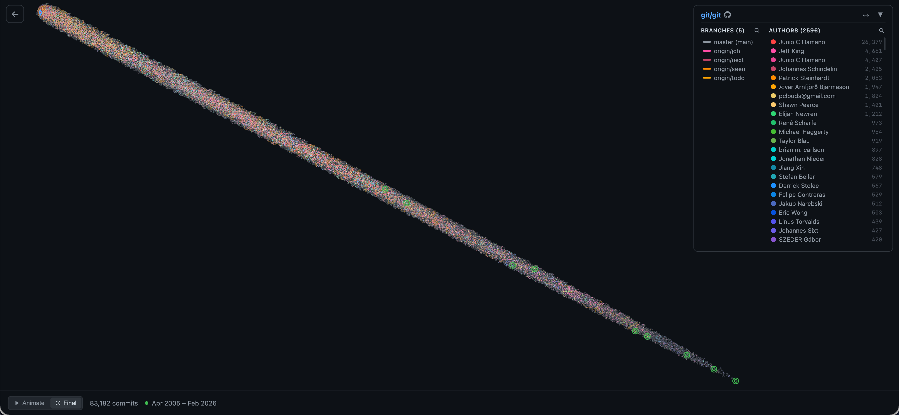
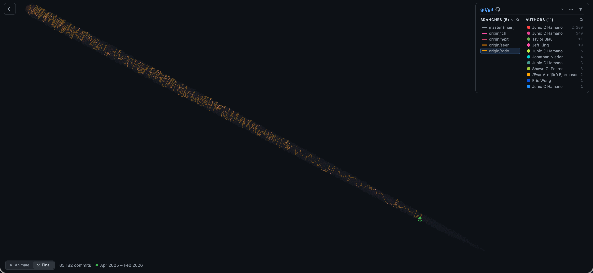
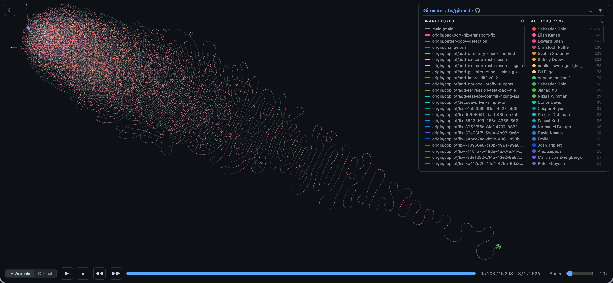
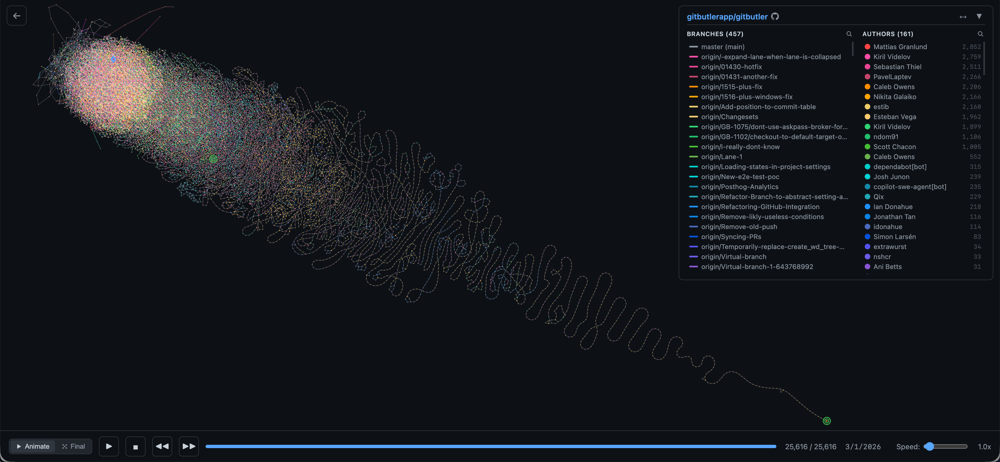
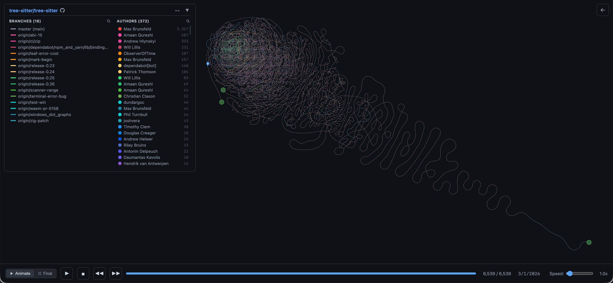

# Git Commits Threadline

Visualize and analyze complete Git commit histories as animated force-directed graphs.
See how commit density, branch activity, and contributor participation evolve over time.

**Live site:** https://nshcr.github.io/git-commits-threadline/

Open the demo index, pick a repository, and inspect its history immediately.

## Why this is useful

This project helps you quickly inspect:

- repository growth over long time ranges
- branch structure and active thread distribution
- contribution patterns across maintainers and collaborators

## Demo Gallery

### [Git](https://github.com/git/git)



For `git`, the graph is showcased in **Final** mode because it better reveals long-range evolution, commit density, and time-stage distribution across a very large history.



For the same repository, this view highlights only `origin/todo`, making a single branch thread stand out inside the full historical topology.

### [Gitoxide](https://github.com/GitoxideLabs/gitoxide)



### [GitButler](https://github.com/gitbutlerapp/gitbutler)



### [tree-sitter](https://github.com/tree-sitter/tree-sitter)



## Rendering Modes: Animate vs Final

The graph provides two complementary reading modes:

- **Animate mode**
    - Plays commits progressively over time.
    - Best for understanding **growth dynamics**: sparse early activity, gradual expansion, then dense late-stage development.
    - Tends to look more **non-linear**, with stronger accumulation near later phases.

- **Final mode**
    - Loads all chunks, renders the completed graph, then lets the force layout settle.
    - Best for understanding **global structure** and **time-stage correlation** at full scale.
    - Especially effective for large and long-lived repositories like `git`.

In short: **Animate shows how a project grows**, while **Final shows the full historical geometry at once**.

## Getting Started

**Requirements:** [Rust](https://rustup.rs/), [Node.js](https://nodejs.org/) with [pnpm](https://pnpm.io/)

```bash
git clone https://github.com/nshcr/git-commits-threadline.git
cd git-commits-threadline

cd frontend && pnpm install && cd ..
./scripts/export.sh        # builds frontend + generates graph data → dist/
npx serve dist             # preview locally
```

For GitHub Pages subpath deployments, set `BASE_PATH` before running export:

```bash
BASE_PATH=/git-commits-threadline/ ./scripts/export.sh
```

## Local Development — Adding Repositories

Each subdirectory under `repos/` is treated as a git repository. `repos/` is git-ignored and local-only.

```bash
# symlink, clone or copy — any works
git clone https://github.com/owner/repo.git repos/repo
ln -s /path/to/local-repo repos/local-repo
```

Then rebuild with `./scripts/export.sh`.

## CI Repository Config — `repos.yml`

`repos.yml` at the project root lists the repositories built and deployed by CI:

```yaml
repositories:
  git:
    - git
  GitoxideLabs:
    - gitoxide
```

The CI workflow reads `repos.yml`, expands it to a parallel matrix (one job per repo), aggregates successful artifacts, and deploys to GitHub Pages.

## Contributing

Contributions are welcome: repository additions, visualization improvements, bug fixes, and feature ideas.

**Add a repository:** edit `repos.yml` and open a PR. CI will start building it automatically once merged.

**Other contributions:** open an issue or PR. The architecture is straightforward:

- Rust backend exports commit graph data
- Vite/TypeScript frontend renders and animates the graph

## Acknowledgements

Built on the shoulders of two excellent libraries:

- **[Gitoxide](https://github.com/GitoxideLabs/gitoxide)** — a pure-Rust Git implementation that makes traversing commit graphs both fast and a pleasure to work with
- **[D3.js](https://github.com/d3/d3)** — the force simulation and rendering backbone of every graph on this site

## A Note on Authorship

The code in this repository was written almost entirely by Claude (Opus / Sonnet). I directed the design, skimmed the output, and occasionally said "that looks wrong".

If you spot something that indeed looks wrong — feel free to summon your own Claude and have it fix things!

## License

MIT
